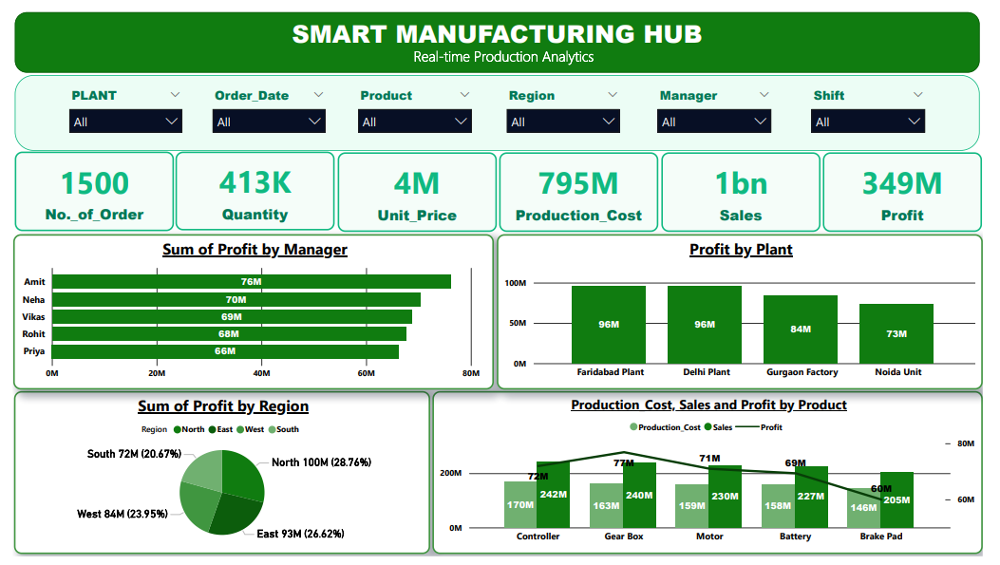

# Smart Manufacturing Hub Dashboard Project

## Overview

The Smart Manufacturing Hub Dashboard is a real-time production analytics solution developed using Power BI.

This dashboard provides comprehensive insights into manufacturing performance, sales, profitability, production cost analysis, and operational efficiency across multiple manufacturing facilities.

The solution integrates live production data from Google Sheets and enables interactive business intelligence reporting for executive-level decision-making.

---

# Dashboard Preview



---

## Key Business Metrics

| KPI | Value |
|------|------|
| Total Orders | 1500 |
| Total Quantity | 413K |
| Unit Price | 4M |
| Production Cost | ₹795M |
| Total Sales | ₹1B |
| Total Profit | ₹349M |

---

## Dashboard Features

### Executive KPI Monitoring
- Real-time monitoring of:
  - Orders
  - Quantity
  - Sales
  - Profit
  - Production Cost

### Interactive Filtering
Dynamic slicers allow filtering by:
- Plant
- Order Date
- Product
- Region
- Manager
- Shift

### Profitability Analysis
- Profit analysis by Manager
- Profit comparison across manufacturing plants
- Region-wise profit contribution analysis

### Product Performance Analysis
- Production Cost vs Sales vs Profit trends
- Product category comparison
- Operational efficiency insights

### Multi-Plant Analytics
Production tracking across:
- Faridabad Plant
- Delhi Plant
- Gurgaon Factory
- Noida Unit

---

## Business Objectives

The dashboard was developed to:

- Improve manufacturing visibility
- Track operational performance in real time
- Analyze production profitability
- Compare plant-level performance
- Support strategic production planning
- Enable data-driven executive decisions

---

## Tools & Technologies Used

- Power BI
- DAX
- Google Sheets Integration
- Data Modeling
- Data Visualization
- Power Query
- Real-Time Data Refresh

---

## Key Insights Generated

- Delhi and Faridabad plants generated the highest profits
- North region contributed the largest share of total profit
- Gear Box category delivered strong sales performance
- Manager-wise profitability trends highlighted top performers
- Production cost optimization opportunities identified across products

---

## Repository Contents

```text
Smart-Manufacturing-hub-Dashboard-Project
│
├── Smart-Manufacturing-hub-Dashboard-Project.pbix
├── Dashboard Image.png
├── Dashboard pdf.pdf
├── Manufacturing_Data.xlsx
└── README.md
```

---

## Author

Ritik Uniyal  
Data Analyst

---

## Project Status

Completed and maintained as a professional portfolio project.
